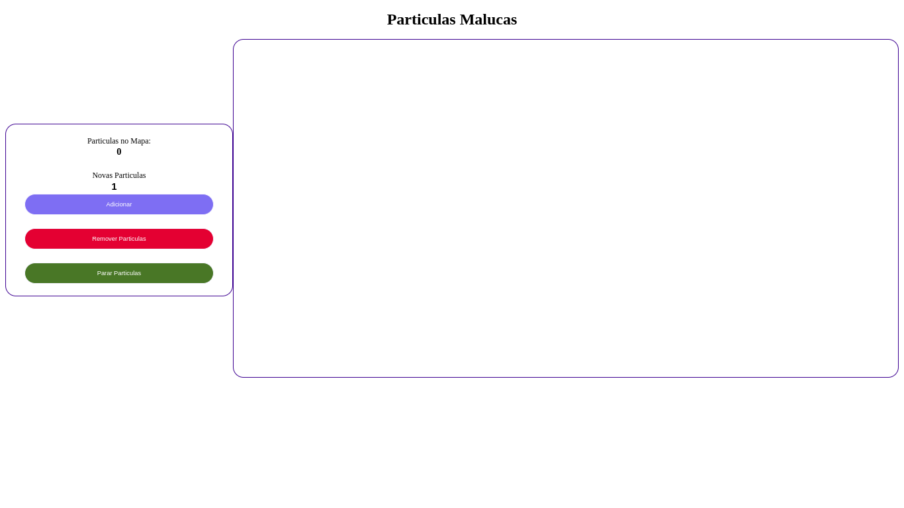
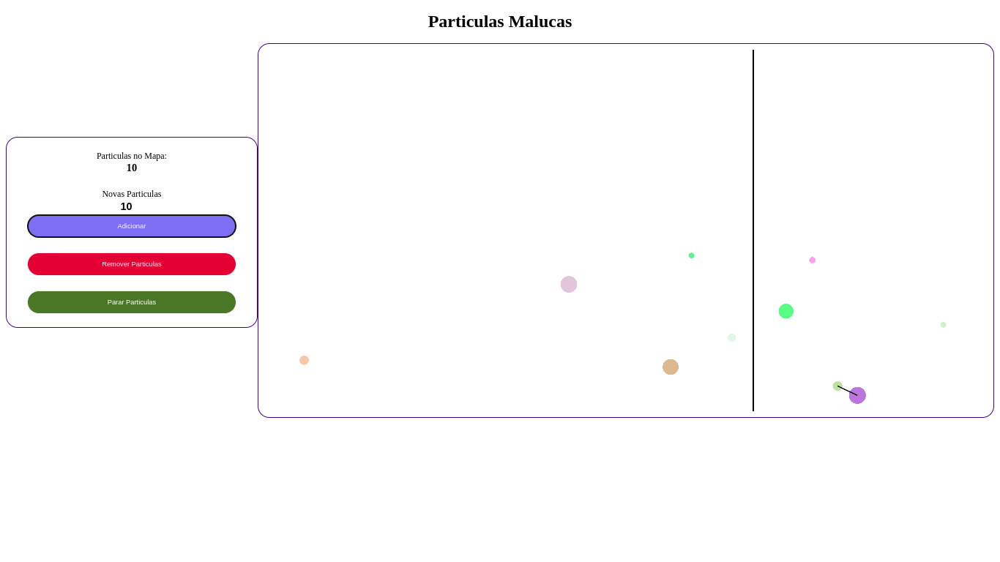

# Particulas Malucas

**Número da Lista**: 23 
**Conteúdo da Disciplina**: Divide & Conquer  

## Alunos
|Matrícula | Aluno |
| -- | -- |
| 18/0105256  |  [Lucas da Cunha Andrade](https://github.com/nYCSTs) |
| 18/0027352  |  [Rodrigo Carvalho dos Santos](https://github.com/Rocsantos) |

## Sobre
Um simples projeto que utiliza do Algoritmo de Dividir e Conquistar para criar colisão de particulas do canvas.

## Screenshots

## Video

[Video do Projeto](assets/video.mp4)

## Instalação
**Linguagem**: Javascript puro 
**Framework**: Nenhuma 

Possuir um navegador, baixar este repositório e abrir o arquivo `index.html` no diretório `app`

## Uso
Você pode baixar o repositório, ou acessar a página da aplicação [aqui](https://projeto-de-algoritmos.github.io/DC_Dupla23_MinDist/app/).
